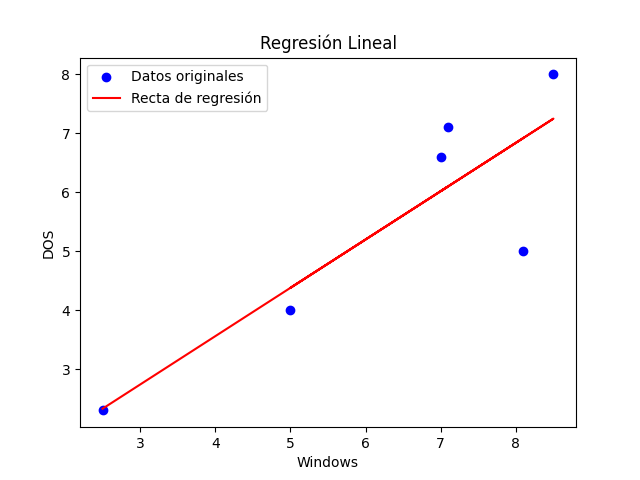

# 4) Los siguientes datos corresponden a los tiempos relativos en segundos que tardaron en ejecutarse seis programas elegidos al azar en el entorno Windows y en DOS : Programas

| x | Programas |
|---|-----------|
|Windows| 2,5 7,1 5 8,5 7 8,1 |
| Linux| 2,3 7,1 4 8 6,6 5 |

## a) Realizar el grafico de dispersión de los puntos

## b) Si un programa tarda 6 segundos en ejecutarse en Windows, ¿Cuánto tardara en ejecutarse en DOS?

Uso la función de regresión lineal: $ \hat{y} = \hat{\beta_1}x + \hat{\beta_0} = 0.820x + 0.279 $
- Reemplazo x por el valor 6 y resuelvo $ \hat{y} = 0.820*6+0.279 = 5.199 $
- DOS tarda 5.199 segundos.

## c) Se estima que los tiempos de Windows mejoraran reduciéndose en un 10% en los próximos años, estime la recta de regresión considerando esta mejora. Suponga que los tiempos DOS no se modifican

Para calcular la mejora sobre los tiempos de Windows, hay que multiplicar un 0.9 a $ \hat{\beta_1}x $

$$ \hat{y} = 0.9 * \hat{\beta_1}x + \hat{\beta_0} = 0.9 * 0.820x + 0.279 = 0.738 + 0.279 $$