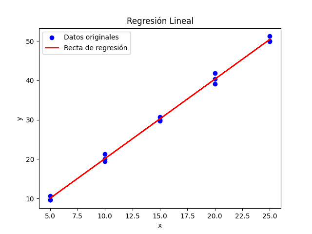

# 5) En la tabla siguiente, se muestran la variable 𝑦, rendimiento de un sistema informático, respecto a la variable 𝑥, numero de buffer:

| x | 5 | 10                           | 15                                                               | 20                                                          | 25                                                     | 5                                                 | 10                                            | 15                                       | 20                                  | 25                             | 5                         | 10                   | 15              | 20         | 25    |
|---|--|----|-------|----|----|---|-----------|---------|-------------------------------------|--------------------------------|---------------------------|----------------------|-----------------|------------|-------|
| y | 9.6 | 20.1|  29.9|  39.1|  50.0|  9.6|  19.4|  29.7|  40.3|  49.9|  10.7|  21.3|  30.7|  41.8|  51.2 |

A partir de la tabla anterior, se quiere ajustar la variable y como función de x.

## a) Realizar el analisis de regresión de los datos (Estimación de la recta, Test de Hipótesis, Indicadores).

* S_XX: 750.000
* S_YY: 3064.324
* S_XY: 1514.000
* Pendiente (β1): 2.019
* Ordenada (β0): -0.060
* SS_R (Suma de residuos al cuadrado): 8.063
* Varianza residual (sigma²): 0.620
* Coeficiente de determinación (R²): 0.997
* Coeficiente de correlación lineal (r): 0.999

- Estimación de la recta:

$$ \hat{y} = \hat{\beta_1}x + \hat{\beta_0} = 2.019x - 0.060 $$

### Test de hipótesis sobre $ \beta_1 $:
- Queremos probar la hipótesis de que $ \beta_1 $ es 0. Partimos de las hipótesis:

$$ H_0:\beta_1 = 0 \quad H_1:\beta_1 \ne 0 $$

- Estadístico de prueba:

$$ T = \frac{\hat{\beta_1} - \theta}{\sqrt{\frac{\hat{\sigma²}}{S_{xx}}}} \thicksim t_{n-2}$$

- Regla de decisión:
  - Se rechaza si $ H_0 $ si $ |T| > t_{\frac{\alpha}{2},n-2} $
  - Caso contrario, se acepta.
- Nivel de significancia: $ \alpha = 0.05 $

$$ T = \frac{2.019 - 0}{\sqrt{\frac{0.620}{750}}} = 70.198 $$
$$ t_{\frac{\alpha}{2},n-2} = t_{0.025,13} = 2.16 $$

- Como $ |70.198| > 2.16 $, entonces $ H_0 $ se rechaza.

## b) Comentar los resultados siguientes:

### Recta de regresión del rendimiento del sistema informático frente al número de buffers e interpretación de los coeficientes.

- La recta de regresión se ajusta al modelo casi al 100% (lo cuál se puede ver en $ R² $).
- Hay una gran correlación entre x e y, ya que r es muy cercano a 1.

### Contraste de hipótesis sobre la pendiente de la pendiente de la recta.

- La hipotesis de $ \beta_1 $ igualado a 0 se rechaza, por lo que x tiene importancia al explicar la variabilidad en Y.
- Puede significar que el modelo líneal es adecuado, o que pueden obtenerse mejores resultados agregando téminos polinomiales de mayor grado en x.

