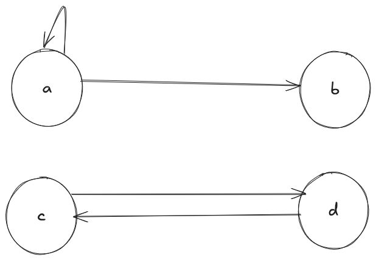
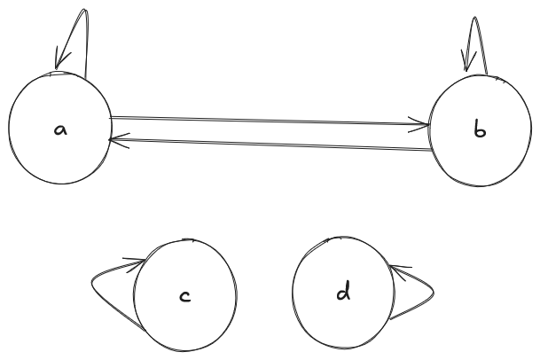
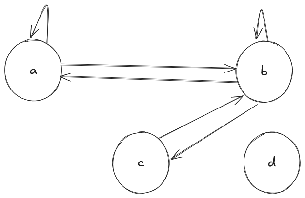
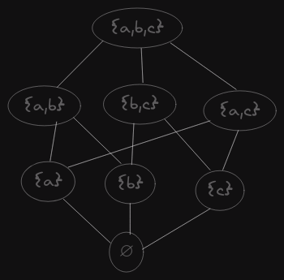
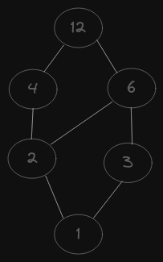
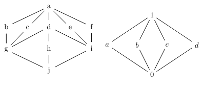

# TP4 - Relaciones entre conjuntos

## 1. Sean los conjuntos A = {1, 0, −1} y B = {4, 3, 2, 1}. Decide si las siguientes corresponden a relaciones de A en B. Justifica.

### (a) R = {(1; 1), (0; 2)}

- Se corresponde, ya que el primer elemento de cada dupla pertenece al conjunto A y el segundo elemento de cada dupla pertenece al conjunto B.

### (b) R = {(−1; 1), (1; −1)}

- En la segunda dupla, el segundo elemento no pertenece al conjunto B. Por lo tanto esta R no se corresponde a la relación entre A y B.

### (c) R = {(−1; 1), (−1; 2), (−1; 3)}

- Es válida, ya que -1 pertenece al conjunto A y 1, 2 y 3 pertenecen al conjunto B.

### (d) R = {(4; 1)}

- No se corresponde a una relación entre A y B ya que 4 no es un componente del conjunto A.

### (e) R = ∅

- Si se corresponde, ya que el vacío se incluye en todos los conjuntos.

## 2. Sea A = {−3, −2, −1, 0, 1, 2, 3}, B = Z y la relación de A en B que viene definida en la forma: $ xRy $ si y sólo si $ y $ es el cuadrado de $ x $. Escribe R por extensión. Define R^{−1} por comprensión y por extensión.

<u>$ R $ por extensión:</u>

$$
R = \{ (-3,9), (-2, 4), (-1, 1), (0,0), (1,1), (2,4), (3,9) \}
$$

<u>$ R^{-1} $ por comprensión:</u>

$$
R^{-1} = \{ (y,x):(x,y) \in \R \} \\
R^{-1} = \{ (y,x): y \in B \land x \in A \land (y = x^2) \}
$$

<u>$ R^{-1} $ por extensión:</u>

$$
R^{-1} = \{ (9,-3), (4, -2), (1, -1), (0,0), (1,1), (4, 2), (9, 3) \}
$$

## 3. Sean los conjuntos A = {a, b, c, d, e} , V = {vocales} y B = {1, 2, 3}. Decide si las siguientes corresponden a relaciones. Justifica.

### (a) R = {(a, a, a); (a, b, c); (b, c, d)} en A × A × A

- Es una relación válida, ya que los elementos de cada tupla está en AxAxA.

### (b) R = {(a, a, a); (c, e, 2); (a, b, 1)} en A × V × B

- La relación no es válida, podemos ver que en el tercer componente de la primera tupla hay una letra (que no está en el conjunto B).
- Además, en el segundo componente de la tercera tupla hay una "b" que no pertenece al conjunto V.

### (c) R = {(a, b, 1); (e, c, 2) : (i, j, 3)} en V × A × B

- La relación no es válida, ya que en el segundo componente de la tercer tupla hay una "j" que no pertenece al conjunto A.

### (d) R = {(a, z, 3); (b, i, 2); (c, x, 1)} en A × V × B

- La relación no es válida, ya que los segundos componentes de la primera y tercera tupla no pertenecen al conjunto V.

## 4. Sea A = {1, 2, 3} y la relación R en A × A × A definida en la forma: (x, y, z) ∈ R si y sólo si x < y & y < z , siendo < el ”menor” usual entre números reales. Escribe R por extensión

$$
R = \{ (1, 2, 3) \}
$$

## 5. Para cada una de las siguientes relaciones: dar tres pares que pertenezcan y tres pares que no; indicar si son reflexivas, simétricas, antisimétricas, y/o transitivas.

### (a) En el conjunto de los números reales

#### xRy si y sólo si x ≥ 4 & y ≥ 5 .

<u>Pares que pertenecen:</u>

- $ (4,5) $
- $ (5,6) $
- $ (6,7) $

<u>Pares que no pertenecen:</u>

- $ (5,4) $
- $ (2, 10) $
- $ (hola, chau) $

No es reflexiva, no se cumple que xRx
- Contraejemplo: $ x = 4 \to (4,4) \notin R $

No es simétrica, no se cumple que xRy entonces yRx
- Contraejemplo: $ (4,5) \in R \to (5,4) \in R $
- El antecedente es verdadero pero el consecuente es falso, por lo tanto, la implicancia es falsa.

No es antisimétrica, ya que no se cumple que xRy e yRx implican x = y.
- Contraejemplo: $ (5,6) \in R \land (6,5) \in R \to 5 = 6  $
- El antecedente es verdadero pero el consecuente es falso, por lo tanto, la implicancia es falsa.

La relación es transitiva, para todo $ (x,y,z) \in \R $, se cumple que $ xRy \land yRz \to xRz $
- Vale $ xRy $ ya que $ x \ge 4 \land y \ge 5 $.
- Vale $ yRz $ ya que $ y \ge 4 \land z \ge 5 $.
- Como $ x \ge 4 $ y $ z \ge 5 $, entonces se cumple que $ xRz $.
- Entonces, tanto el antecedente como el consecuente son verdaderos, por lo tanto la implicación se cumple y se concluye con que se cumple la transitividad.

#### xRy si y sólo si y ≤ x ≤ y + 3 .

<u>Pares que pertenecen</u>

- $ (3, 1) $
- $ (2, 2) $
- $ (5, 2) $

<u>Pares que no pertenecen:</u>

- $ (0, 1) $
- $ (10, 2) $
- $ (hola, 8) $

La relación es reflexiva, para todo $ x \in \R $ se cumple que xRx.
- d Al ser una relación $ \le $, se va a cumplir, ya que todo x es menor o igual que sí misma, y la suma de ese x con 3 es mayor que si misma.

La relación no es simétrica, no se cumple que para todo $ (x,y) \in \R : xRy \to yRx$
- Contraejemplo: $ (3,1) \in R \to (1,3) \in R $
- Como el antecedente es verdadero pero el consecuente es falso, no se cumple la implicancia, por lo tanto no es simétrica.

La relación es antisimétrica, ya que se cumple que para todo $ (x,y) \in R : xRy \land yRx \to x = y $.
- Sean $ (x,y) \in R : x = y $, se cumple que $ xRy \land yRx $ (porque la relación es reflexiva).
- Sean $ (x,y) \in R : x < y $, se cumple que $ x \le y \le x+3 $ por lo tanto $ yRx $ pero no se da que $ xRy $ (porque $ x < y $). Entonces, el antecedente es falso pero la implicancia se cumple.
- Sean $ (x,y) \in R: y < x $, se cumple que $ y \le x \le y+3 $ y por lo tanto $ xRy $ pero no se da que $ yRx $ (porque $ y < x $). Entonces, el antecedente es falso pero la implicancia se cumple.

La relación no es transitiva, ya que no se cumple que para todo $ (x,y,z) \in R : xRy \land yRz \to xRz $
- Contraejemplo: $ (10, 7) \in xRy \land (7,4) \in yRz \to (10,4) \in xRz $
- Como el antecedente es verdadero y el consecuente es falso, la implicancia es falsa, por lo tanto no es transitiva.

### (b) Sean A = {1, 2, 3, 4} y P(A) el conjunto de partes de A

$$
P(A) = \{ (\empty),(1),(2),(3),(4),(1,2),(1,3),(1,4),(2,1),(2,2)(2,3),(2,4), \\ (3,1),(3,2),(3,3),(3,4),(4,1),(4,2),(4,3),(4,4),(1,1,1)(1,1,2),(1,1,3), \\ (1,1,4),..., (1,2,3,4) \}
$$

#### En P(A), xRy si y sólo si x ∩ y = ∅

<u>Pares que pertenecen</u>

- {(1),(2,3)}
- {(2),(3,4)}
- {(1,2,3),(4)}

<u>Pares que no pertenecen:</u>

- ({2,2},{2,2})
- ({1,1},{1,1})
- ({1,2,3},{3,2,1})

La relación no es reflexiva, no se cumple que para todo $ x \in P(A) $ que $ xRx $.
- Contraejemplo: $ (\{1\}) \in P(A) $ pero $ (\{1\},\{1\}) \notin R$.

La relación si es simétrica, se da que para todo $ (x,y) \in P(A) : xRy \to yRx $
- Si $ xRy $ vale, entonces se cumple que $ x \cap y = \empty $.
- Como la intersección es conmutativa, se puede $ y \cap x = \empty $, entonces $ yRx $.
- Por lo tanto $ xRy \to yRx $.

La relación no es antisimétrica, no se cumple que para todo $ (x,y) \in P(A) : xRy \land yRx \to x = y $.
- Contraejemplo: $ (\{1,2\}, \{3,4\}) \in R \land (\{3,4\},\{1,2\}) \in R \to \{1,2\} = \{3,4\} $
- Como el antecedente es verdadero y el consecuente es falso, la implicación es falsa, por lo tanto no es antisimétrica

La relación no es transitiva, no se cumple que para todo $ (x,y,z) \in P(A): xRy \land yRz \to xRz $
- Contraejemplo: $ (\{1,4\},\{2\}) \in R \land (\{2\},\{3,4\}) \in R \to (\{1,4\},\{3,4\}) \in R $.
- Como el antecedente es verdadero y el consecuente es falso, la implicancia es falsa, por lo tanto no es simétrica.

#### En P(A), xRy si y sólo si X ⊂ Y

Lo dejo para el repaso

<u>Pares que pertenecen</u>

<u>Pares que no pertenecen:</u>

## 6. Determinar si las siguientes relaciones definidas en A = {a, b, c, d} son reflexivas, simétricas, antisimétricas y transitivas:

### $ R_0 = ∅ $

No es reflexiva porque que para todo $ x \in A: xR_0x $.
- Contraejemplo: $ a \in A $ pero $ (a,a) \notin R_0 $.

Es simétrica, para todo $ (x,y) \in A: xR_0y \to xR_0y $.
- No se cumple que $ xR_0y $ (el conjunto vacío no tiene elementos), por lo que el consecuente siempre es falso y la implicancia siempre se cumple. Por lo tanto, es simétrica.

Es antisimétrica, para todo $ (x,y) \in A: xR_0y \land yR_0x \to x = y $
- Como el conjunto vacío no tiene elementos, no se cumple $ xR_0y $ ni $ yR_0x $, por lo que el consecuente siempre es falso y la implicancia se cumple.

Es transitiva, para todo $ (x,y,z) \in A: xR_0y \land yR_0z \to xR_0z $.
- Como el conjunto vacío no tiene elementos, no se cumple $ xR_0y $ ni $ yR_0z $, por lo que el consecuente es falso y la implicancia se cumple trivialmente.

### $ R_1 = \{(a, a); (a, b); (d, c); (c, d)\} $

No es reflexiva, no se cumple que para todo $ x \in A: xR_1x $.
- Contraejemplo: Se cumple que $ d \in A $ pero no que $ (d,d) \in R_1 $.

No es simétrica, no se cumple que para todo $ (x,y) \in A: xR_1y \to yR_1x $.
- Contraejemplo: Se cumple que $ \{ (a,b) \} \in R_1 $ pero no se cumple que $ \{(b,a)\} \in R_1 $.

Tampoco es antisimétrica, no se cumple que para todo $ (x,y) \in A: xR_1y \land yR_1x \to x = y $.
- Contraejemplo: Se cumple que $ \{(c,d)\} \in R_1 \land \{(d,c)\} \in R_1 $ pero no se cumple que $ c = d $.

No es transitiva, no se cumple que para todo $ (x,y,z) \in A: xR_1y \land yR_1z \to xR_1z $.
- Contraejemplo: Se cumple que $ \{(d,c)\} \in R_1 \land \{(c,d)\} \in R_1 $ pero no se cumple que $ \{(d,d)\} \in R_1 $.

### $ R_2 = \{(a, a); (b, b); (a, b); (b, a); (d, d); (c, c)\} $

La relación es reflexiva, se cumple para todo $ x \in A $ que $ xR_2x $.
- $ a \in A $ y se cumple $ (a,a) \in R_2 $
- $ b \in A $ y se cumple $ (b,b) \in R_2 $
- $ c \in A $ y se cumple $ (c,c) \in R_2 $
- $ d \in A $ y se cumple $ (d,d) \in R_2 $

Es simétrica, se cumple para todo $ (x,y) \in A: xR_2y \to yR_2x $.
- $ aR_2a \to aR_2a $
- $ bR_2b \to bR_2b $
- $ aR_2b \to bR_2a $
- $ bR_2a \to aR_2b $
- $ dR_2d \to dR_2d $
- $ cR_2c \to cR_2c $ 

La relación no es antisimétrica, ya que no se cumple que para todo $ (x,y) \in A: xR_2y \land yR_2x \to x = y $.
- Contraejemplo: Se cumple que $ (a,b) \in xR_2y \land (b,a) yR_2x $ pero no se cumple que $ a = b $.

Es transitiva, se cumple que para todo $ (x,y,z) \in A: xR_2y \land yR_2z \to xR_2z $.
- Se cumple $ xR_2y $, puesto que $ (a,b) \in R_2 $.
- Se cumple $ yR_2z $, puesto que $ (b,a) \in R_2 $.
- También se cumple que $ xR_2z $, ya que $ (a,a) \in R_2 $.

### $ R_3 = \{(a, a); (a, b); (b, a); (b, c); (c, b); (b, b)\} $

La relación no es reflexiva, no se cumple que para todo $ x \in A: xR_3x $
- Contraejemplo: Se cumple que $ c \in A $ pero no que $ (c,c) \in R_3 $.

La relación es simétrica, ya que se cumple que para todo $ (x,y) \in A: xR_3y \to yR_3x $.

La relación no es antisimétrica, no se cumple que para todo $ (x,y) \in A: xR_3y \land yR_3x \to x = y $.
- Contraejemplo: Se cumple que $ (b,c) \in R_3 \land (c,b) \in R_3 $ pero no es cierto que $ b = c $.

La relación no es transitiva, ya que no se cumple que para todo $ (x,y,z) \in A: xR_3y \land yR_3z \to xR_3z $.
- Contraejemplo: Se da que $ (a,b) \in R_3 \land (b,a) \in R_3 $ pero no que $ (a,c) \in R_3 $.

### R4 = A × A

Para repasar.

## 7. Escribir la matriz y los digrafos asociados a las relaciones anteriores

<u>Para $R_1$:</u>

| | a | b | c | d |
|-|---|---|---|---|
|a| 1 | 1 | 0 | 0 |
|b| 0 | 0 | 0 | 0 |
|c| 0 | 0 | 0 | 1 |
|d| 0 | 0 | 1 | 0 |

<u>Para $R_2$:</u>

| | a | b | c | d |
|-|---|---|---|---|
|a| 1 | 1 | 0 | 0 |
|b| 1 | 1 | 0 | 0 |
|c| 0 | 0 | 0 | 1 |
|d| 0 | 0 | 0 | 1 |

<u>Para $R_3$:</u>

| | a | b | c | d |
|-|---|---|---|---|
|a| 1 | 1 | 0 | 0 |
|b| 1 | 1 | 1 | 0 |
|c| 0 | 1 | 0 | 0 |
|d| 0 | 0 | 0 | 0 |

## 8. Sea A = {a, b, c, d}

### (a) Dar un ejemplo de una relación R no reflexiva en A

$$
R = \{ (a,b); (b,c); (c,d); (d,a) \}
$$

### (b) Dar un ejemplo de una relación R simétrica en A

$$
R = \{ (a,b); (b,a); (a,c); (c,a); (a,d); (d,a); (b,c); (c,b); \}
$$

### (c) Dar un ejemplo de una relación R no transitiva en A

$$
R = \{ (a,b); (b,a); (b,c); (c,d); \}
$$

### (d) Dar un ejemplo de una relación R no simétrica en A

$$
R = \{ (a,a); (a,b); (b,a); (a,c); (d,d); (c,c) \}
$$

### (e) Dar un ejemplo de una relación R antisimétrica en A

$$
R = \{ (a,a); (a,b); (b,b); (d,c) \}
$$

## 9. Demostrar que si R es simétrica y transitiva y aRb para ciertos a y b, entonces aRa y bRb.

La simetría nos dice que $ aRb $ entonces $ bRa $.
- Entonces, al tener aRb y R ser simétrica, tenemos que $ bRa $.

La transitividad nos dice que $ xRy \land yRz \to xRz$
- Entonces, al ser R transitiva y tener que $ aRb $ y $ bRa $ entonces se da que $ aRa $.
- Trivialmente para el caso de $ bRb $, al ser R transitiva y tener que $ bRa $ y $ aRb $, entonces se cumple que $ bRb $.

## 10. Sea A un conjunto arbirtario. Sea R = ∆A (diagonal de A). Analizar qué propiedades tiene R.

Es reflexiva, ya que cada elemento de la diagonal de A se relaciona consigo mismo, cumpliendo que para todo $ x \in A $ tal que $ xRx $.

Es simétrica, se cumple que para todo $ (x,y) \in \delta A : xRy \to yRx $.
- Para $ a, b \in A $ tal que $ a = b $, vale que $aRb$ y $bRa$, haciendo que se cumpla $aRb \to bRa$ (antecedente y consecuente verdaderos).
- Para $ a, b \in A $ tal que $ a \ne b $, no vale $aRb$ ni $bRa$, haciendo que la implicación se cumpla (antecedente y consecuente falsos).

Es antisimétrica, se cumple para todo $ (x,y) \in \delta A: xRy \land yRx \to x = y $.
- Para $ a, b \in A $ tal que $ a = b $, vale el antecedente $ xRy $ y $ yRx $, por lo tanto la implicancia se cumple.
- Trivialmente para $ a, b \in A $ tal que $ a \ne b $ (no vale el antecedente ni el consecuente, lo que hace que la implicancia valga).

Es transitiva, se cumple para todo $ x,y,z \in \delta A: xRy \land yRz \to xRz $.
- Para $ a,b,c \in A $ tal que $ a=b=c $, vale el antecedente $ aRb $ y $ bRc $, también vale el consecuente $ aRc $, por lo tanto la implicancia se cumple.
- Análogamente para $ a, b \in A $ tal que $ a \ne b \ne c $; $ a = b \ne c $ y $ a \ne b = c $

## 11. Proponer una relación en el conjunto de los números naturales. Mostrar que propiedades tiene (reflexividad, simetría, etc...).

Sacado de la teoría, la divisibilidad en los números naturales es reflexiva, antisimétrica y transitiva.

## 12. Proponer una relación en el conjunto de los alumnos de Informática. Mostrar que propiedades tiene (reflexividad, simetría, etc...)

A = {alumnos de informática}

$ (x,y) \in R $ si y sólo si $ x $ e $ y $ están inscriptos en la misma materia.

La relación es reflexiva, se cumple que para todo $ x \in A $ que $ xRx $.
- Si el alumno $ x $ está inscripto en alguna materia, entonces él mismo está inscripto en la misma materia. Por lo tanto se da que $ xRx $ para cualquier alumno.

La relación es simétrica, se cumple que para todo $ x,y \in A: xRy \to yRx $.
- Si los alumnos $ x $ e $ y $ están inscriptos en la misma materia, necesariamente $ y $ y $ x $ también lo están (la inscripsión es mutua).

No es antisimétrica, no se cumple que para todo $ x,y \in A: xRy \land yRx \to x = y $.
- Dos alumnos diferentes pueden estar inscriptos en la misma materia, entonces se cumple $ xRy $ y $ yRx $, pero eso no implica que $ x = y $ (son alumnos diferentes).

La relación no es transitiva, no se cumple que para todo $ x,y,z \in A: xRy \land yRz \to xRz $.
- Si $ x $ e $ y $ están inscriptos en la misma materia, e $ y $ y $ z $ están en la misma materia, no necesariamente implica que $ x $ y $ z $ están en la misma materia.

## 13. Dada una relación binaria $ R $ sobre un conjunto A, se define la relación complemento de R, $ \bar{R} $ por: $ a\bar{R}b $ si y sólo si a no está relacionada con b por R.

### Dar un ejemplo de una relación R y su complemento

- $ A = \Z $
- $ R $ = {(x,y): y es el doble de x}
- $ \bar{R} $ = {(x,y): y no es el doble de x}

### Probar que si R ⊂ S entonces $ \bar{S} \sub \bar{R} $

1. $ x,y \in S \to x,y \notin S $ Definición de complemento.
2. $ x,y \in \bar{R} \to x,y \notin R $ Definición de complemento.
3. $ R \sub S \to x,y \in R \to x,y \in S $ Definición de subconjunto.
4. $ x,y \notin S \to x,y \notin R $
5. $ x,y \notin S \to x,y \in \bar{S} $
6. $ x,y \notin R \to x,y \in \bar{R} $
7. Entonces, podemos decir que $ x,y \in \bar{S} to x,y \in bar{R} $.
8. $ x,y \in \bar{S} \to x,y \in \bar{R} \to \bar{S} \sub \bar{R} $.

## 14. Dada R una relación binaria sobre A, probar que:

### (a) R es reflexiva si y sólo si R^{-1} también lo es

$ R $ es reflexiva $ \to R^{-1} $ es reflexiva.
- $ x \in R \to xRx $
- Si R es reflexiva, para todo $ x \in A $ se cumple que $ xRx $.
- Por definición del inverso: $ xRx \to xR^{-1}x $.
- Al tener $ xR^{-1}x $ implica que $ x \in R^{-1}.
- Entonces, para todo $ x \in A $ vale que $ xR^{-1}x $, entonces $ R^{-1} es reflexiva.

$ R^{-1} $ es reflexiva $ \to R $ es reflexiva.
- $ x \in R^{-1} \to xR^{-1}x $.
- Si $ R^{-1} $ es reflexiva, para todo $ x \in A $ se cumple que $ xR^{-1}x $.
- Por definición del inverso: $ xR^{-1}x \to xRx $.
- Al tener $ xRx $, eso implica que $ x \in R $.
- Entonces, para todo $ x \in A $ vale que $ xRx $, entonces R es reflexiva.

### (b) R es simétrica si y sólo si R^{−1} = R

R es simétrica $ \to R^{-1} = R $.
- $ x, y \in R \to xRy $.
- $ xRy \to yRx $.
- Si R es simétrica, para todo $ x,y \in A $ vale que $ xRy $.
- $ yRx \to y,x \in R $.
- Por definición de inverso: $ yRx \to xR^{-1}y $
- Al tener que $ xR^{-1}y $ eso implica que $ x,y \in R^{-1} $.
- Entonces $ R \sube R^{-1} $

- Tenemos que $ w, z \in R^{-1} \to wR^{-1}z $
- Por definición de inverso: $ wR^{-1}z \to zRw $
- Si R es simétrica, $ w, z \in A $ vale que $ zRw \to wRz $.
- Entonces, $ aRb \to a, b \in R $.
- Por lo tanto, $ R^{-1} \sube R $.

$ R^{-1} = R \to R $ es simétrica.
- Por hipótesis ($ R^{-1} = R $) tenemos que x,y \in R \to x, y \in R^{-1}.
- Por definición de inverso: $ x,y \in R^{-1} \to y,x \in R $.
- $ x,y \in R \to xRy $.
- $ y,x \in R \to yRx $
- Empezamos diciendo que $ xRy $ y llegamos a que $ yRx $, por lo tanto R es simétrica.

### (c) R es simétrica si y sólo si R^{−1} y $ bar{R} $ también lo son

### (d) R es antisimétrica si y sólo si R ∩ R^{−1} ⊂ ∆A

## 15. Se dice que una relación R sobre un conjunto A es asimétrica si cada vez que a está relacionado con b no se da que b esté relacionado con a. Dar un ejemplo de una relación asimétrica.

$$
A = (a,b,c,d) \\
R = \{(a,b),(c,d)\} 
$$

## 16. Probar que dada una relación R sobre un conjunto A, R es asimétrica si y sólo si $ R ∩ R^{-1} = ∅ $.

R es asimétrica $ \to R \cap R^{-1} = \empty $.
- Por definición de asimetria, tenemos que para todo $ x,y \in A: x,y \in R \land y,x \notin R $.
- Por definición de inverso, tenemos que $ xRy \to yR^{-1}x $
- Entonces, para todo $ x, y \in A: y,x \notin R \land y,x \in R^{-1} \to R \cap R^{-1} = \empty $

$ R \cap R^{-1} = \empty \to R $ es asimétrica.
- Partimos de que $ R \cap R^{-1} = \empty $, lo que significa que $ x,y \in R \to y,x \notin R $.
- Por definición de inverso: $ y,x \in R^{-1} \to x,y \in R$.
- Para todo $ x,y \in A $ se da que $ x,y \in R \land y,x \notin R $, por lo tanto, R es asimétrica.

## 17. Sean R y S dos relaciones en A. Probar que:

### (a) Si $ R ⊂ S $ entonces $ R^{−1} ⊂ S^{−1}

La hipótesis es que $ R \sub S $, lo que significa que $ (x,y) \in R \to (x,y) \in S $ (para todo $ x,y \in A $).
- Definición de inversa: $ (x,y) \in R \to (y,x) \in R^{-1} $ y $ (x,y) \in S \to (y,x) \in S^{-1} $.
- Dado que $ (x,y) \in R \to (x,y) \in S $, se tiene que $ (y,x) \in R^{-1} \to (y,x) \in S^{-1} $.
- Por lo tanto $ R^{-1} \sub S^{-1} $.

### (b) Si R y S son reflexivas entonces $ R ∪ S $ y $ R ∩ S $ también lo son.

Por hipótesis tenemos que, para todo $ x \in A $, se cumple que $ x \in R: xRx $ y $ x \in S: xSx $.
- La relación $ R \cup S $ contiene todos los pares que están en $ R $ o en $ S $. Dado que para todo $ x \in A $ se cumple que $ xRx $ y que $ xSx $ (ambas son reflexivas), se cumple que $ xR \cup Sx $.
- La relación $ R \cap S $ contiene todos los pares que están en $ R $ y en $ S $. Como R y S son reflexivas para todo $ x \in A $, se cumple que $ xR \cap Sx $. 

### (c) Si R y S son simétricas entonces $ R ∪ S $ y $ R ∩ S $ también lo son.

Por hipótesis, tenemos que para todo $ x \in A $, se cumple que $ (x,y) \in R: xRy \to yRx $ y que $ (x,y) \in S: xSy \to ySx $.
- La relación $ R \cup S $ contiene todos los pares que están en $ R $ o en $ S $. Como ambas relaciones son simétricas, si $ xR \cup Sy $ entonces también se da que $ yR \cup Sx $.
- La relación $ R \cap S $ contiene todos los pares que están en ambas relaciones $ R $ y $ S $. Como $ R $ y $ S $ son simétricas, si $ xR \cap Sy $, entonces también se da que $ yR \cap Sx $.

## 18. Establecer las propiedades de las siguientes relaciones en H el conjunto de los seres humanos:

### (a) Sea R la relación en H definida por xRy si y sólo si x es hermano de y

- No es reflexiva porque una persona no es su propio hermano. No se cumple que para todo $ x \in H: xRx $.
- Es simétrica, porque si $ x $ es hermano de $ y $, entonces $ y $ también es hermano de $ x $. Formalmente: $ xRy \to yRx $.
- No es antisimétrica, no se da que para todo $ x,y \in R: xRy \land yRx \to x = y  $. Si $ x $ es hermano de $ y $ e $ y $ es hermano de $ x $, no implica que $ x = y $ (son distintas personas).
- No es transitiva. Que $ x $ sea hermano de $ y $ e $ y $ sea hermano de $ z $ no implica que $ x $ sea hermano de $ z $. No se cumple que para todo $ x,y,z \in R: xRy \land yRz \to xRz $.

### (b) Sea R la relación en H definida por xRy si y sólo si x es hijo de y

- No es reflexiva, no se da que para todo $ x \in H: xRx $. Una persona no puede ser su propio hijo.
- No es simétrica, no se da que para todo $ (x,y) \in H: xRy \to yRx $. Si $ x $ es hijo de $ y $, no es verdad que $ y $ sea hijo de $ x $.
- Es antisimétrica. Si $ x $ es hijo de $ y $ e $ y $ es hijo de $ x $, esto implicaría que $ x = y $, lo cuál es imposible en el conjunto $ H $ (una persona no puede ser su propio hijo).
- No es transitiva. Si $ x $ es hijo de $ y $ e $ y $ es hijo de $ z $, no implica que $ x $ sea hijo de $ z $ (sino que $ x $ sería nieto de $ z $).

### (c) Se dice que una persona a es descendiente de una persona b si es hijo, nieto, bisnieto, etc.. R es la relación en H definida por xRy si y sólo si x es descendiente de y.

- No es reflexiva. Una persona no es su propio descendiente.
- No es simétrica. Si $ x $ es descendiente de $ y $, no se cumple que $ y $ es descendiente de $ x $.
- Es antisimétrica. Si $ x $ es descendiente de $ y $ y $ y $ es descendiente de $ x $ entonces $ x = y $ son iguales. Esto no tiene sentido en el conjunto de humanos, por lo que el antecedente es falso y la implicancia verdadera.
- Es transitiva. Si $ x $ es descendiente de $ y $ e $ y $ es descendiente de $ z $, entonces es verdad que $ x $ es descendeinte de $ z $.
  - Si $ x $ es hijo de $ y $ e $ y $ es hijo de $ z $, entonces $ x $ es nieto de $ z $.

## 19. Establecer las propiedades de las siguientes relaciones:

### (a) Sea N el conjunto de los números naturales. Sea ≤ la relación en N dada por x ≤ y si y sólo si x es menor o igual a y

- Es reflexiva, para todo $ x \in \N $, se cumple que $ x \le x $ (cualquier natural es menor o igual que sí mismo).
- No es simétrica. No se cumple que para todo $ (x,y) \in \N: x \le y \to y \le x $.
  - Ejemplo: Es cierto que $ 2 \le 5 $ pero no es cierto que $ 5 \le 2 $.
- Es antisimétrica. Se cumple que para todo $ (x,y) \in \N: x \le y \land y \le x \to x = y $. Si se cumple la relación mutuamente para dos números, necesariamente son iguales.
- Es transitiva. Se cumple que para todo $ (x,y,z) \in \N: x \le y \land y \le z \to x \le z $.
  - Si $ 2 \le 5 $ y $ 5 \le 8 $, entonces $ 2 \le 8 $.

### (b) Sea N el conjunto de los números naturales. Sea | la relación en N dada por x|y si y sólo si x divide a y.

- Es reflexiva. Para todo $ x \in \N: x|x $, ya que cualquier natural se divide así mismo (con $ c = 1 $).
- No es simétrica. No se cumple que para todo $ (x,y) \in \N: x|y \to y|x $.
  - Contrajemplo: Se da que 2|6 pero no que 6|2.
- Es antisimétrica. Para todo $ x,y \in \N: x|y \land y|x \to x = y $. Si x divide a y (y vicerversa), ambos son necesariamente iguales.
- Es transitiva. Para todo $ x,y,z \in \N: x|y \land y|z \to x|z $. Si 2|6 y 6|12 entonces 2|12.

### (c) Igual al anterior pero en el conjunto de los enteros.

Es igual que la anterior solo que no es antisimétrica. Si x|y e y|x no implica que x = y.
- Contraejemplo: Se cumple que 3|-3 y -3|3, pero no son iguales.

## 20. Dado un conjunto de números reales A probar que la relación sobre A × A dada por (a,b)R(c,d) si y sólo si a ≤ c y b ≤ d es un orden. Es total?

Para que una relación sea un orden parcial, debe ser reflexiva, antisimétrica y transitiva.
- Es reflexiva. Se cumple que para todo $ a,b \in A \times A $ se cumple $ (a,b)R(a,b) $. Por la definción de $ R $, se cumple que $ a \le a \land b \le b $.
- Es antisimétrica. Se cumple que para todo $ (a,b),(c,d) \in A \times A: (a,b)R(c,d) \land (c,d)R(a,b) \to (a,b) = (c,d) $.
  - Si $ (a,b)R(c,d) $, entonces $ a \le c \land b \le d $.
  - Si $ (c,d)R(a,b) $, entonces $ c \le a \land d \le b $.
  - Entonces $ a = c \land b = d $, es decir, $ (a,b) = (c,d) $.
- Es transitiva. Se cumple que para todo $ (a,b),(c,d),(e,f) \in A \times A: (a,b)R(c,d) \land (c,d)R(e,f) \to (a,b)R(e,f) $.
  - Si $ (a,b)R(c,d) $, entonces $ a \le c $ y $ b \le d $.
  - Si $ (c,d)R(e,f) $, entonces $ c \le e $ y $ d \le f $.
  - Como $ \le $ es transitiva en $ \R $, se da que $ a \le e $ y $ b \le f $. Por lo tanto, se cumple que $ (a,b)R(e,f) $.
La relación $ R $ es reflexiva, antisimétrica y transitiva, por lo que es un orden parcial.
Una relación es de orden total si para todo $ (a,b),(c,d) \in A \times A $, se cumple que $(a,b)R(c,d)$ o $(c,d)R(a,b)$.
  - En este caso, para que $ R $ sea un orden total, debe ser cierto que dos pares $ (a,b) $ y $ (c,d) $, siempre se cumpla que $ a \le c \land b \le d $ o $ c \le a \land d \le b $.
  - Contraejemplo: Sea $ (a,b) = (1,2) $ y $ (c,d) = (2,1) $, no se cumple que $ 1 \le 2 \land 2 \le 1 $ ni que $ 2 \le 1 \land 1 \le 2 $.
  - Por lo tanto, $ R $ es un orden parcial pero no un orden total.

## 21. Analizar que tipo de orden es el usual en el conjunto de los números reales. ¿qué pasa con los números complejos? ¿están ordenados?

El orden usual en los números reales es la relación $ \le $. Sus propiedades son:
- Reflexiva: Para todo $ x \in \R $, se cumple que $ x \le x $.
- Antisimétrica: Para todo $ x,y \in \R $, se cumple que $ x \le y \land y \le x \to x = y $.
- Transitiva: Si $ x \le y $ y $ y \le z $, entonces se da que $ x \le z $.
- Para todo $ x,y \in \R $, se cumple que $ x \le y $ o que $ y \le x $. Lo que significa que cualquier par de números reales es comparable.
Por lo tanto, la relación $ \le $ en $\R$ es un orden total, ya que todos los números reales son comparables entre sí.

Para los números complejos, no hay un orden total pero si un orden parcial.
- No es total ya que no todos los números complejos son comparables.
- Podemos basarnos en el orden $ \le $ como en los reales, pero teniendo $ \R \times \R $.
- Si tengo dos números complejos $ x = a+bi $ e $ y = c+di $ podríamos comparar las partes reales y las partes imaginarias por separado, es decir:
  - $ (a,b) \le (c,d) $ si y sólo si $ a \le c \land b \le d $.

## 22. Probar que el orden lexicográfico es un orden total

Para probar que el orden lexicográfico es un orden total, debe ser un orden parcial (ser reflexiva, antisimetrica y transitiva) y que sea total.
- Es reflexiva. Para todo $ (a,b) \in A \times A $, se cumple que $ (a,b) \le_{lex} (a,b) $.
  - $ a \le a $ y $ b \le b $.
  - Lo que implica que $ (a,b) \le_{lex} (a,b) $.
- Es antisimétrica. Se cumple que para todo $ (a_1,b_1),(a_2,b_2) \in A \times A $, se cumple que $ (a_1,b_1) \le_{lex} (a_2,b_2) \land (a_2,b_2) \le_{lex} (a_1,b_1) \to (a_1,b_1) = (a_2,b_2) $.
  - Si $ (a_1,b_1) \le_{lex} (a_2,b_2) $, significa que $ a_1 < a_2 $ o $ a_1 = a_2 \land b_1 < b_2 $.
  - Si $ (a_2,b_2) \le_{lex} (a_1,b_1) $, significa que $ a_2 < a_1 $ o $ a_2 = a_1 \land b_2 < b_1 $.
  - Si ambas condiciones son verdaderas, no puede pasar que $ a_1 < a_2 $ y $ a_2 < a_1 $. Por lo tanto, necesariamente es verdadero que $ a_1 = a_2 $ y $ b_1 = b_2 $.
  - Esto implica que $ (a_1,b_1) = (a_2,b_2) $.
- Es transitiva. Se cumple que para todo $ (a_1,b_1),(a_2,b_2),(a_3,b_3) \in A \times A $, se cumple que $ (a_1,b_1) \le_{lex} (a_2,b_2) \land (a_2,b_2) \le_{lex} (a_3,b_3) \to (a_1,b_1) \le_{lex} (a_3,b_3) $.
  - Si $ (a_1,b_1) \le_{lex} (a_2,b_2) $, entonces $ a_1 < a_2 $ o $ a_1 = a_2 \land b_1 \le b_2 $.
  - Si $ (a_2,b_2) \le_{lex} (a_3,b_3) $, entonces $ a_2 < a_3 $ o $ a_2 = a_3 \land b_2 \le b_3 $.
  - Si $ a_1 < a_2 $ y $ a_2 < a_3 $, por la transitividad de $\le$ en $A$, vale que $ a_1 < a_3 $.
  - Si $ a_1 = a_2 $ y $ a_2 = a_3 $, entonces $ a_1 = a_3 $ y también $ b_1 < b_2 < b_3 $, lo que implica que $ b_1 < b_3 $.
  - Por lo tanto, se da que $ (a_1,b_1) \le_{lex} (a_3,b_3) $
- Es total si para todo $ (a_1,b_1),(a_2,b_2) \in A \times A $, se cumple que $ (a_1,b_1) \le_{lex} (a_2,b_2) $ o $ (a_2,b_2) \le_{lex} (a_1,b_1) $.
  - Como $\le$ es un orden total en A, siempre podemos comparar $ a_1 $ y $ a_2 $.
  - Si $ a_1 < a_2 $, entonces $ (a_1,b_1) \le_{lex} (a_2,b_2) $.
  - Si $ a_1 = a_2 $, entonces comparamos $ b_1 $ y $ b_2 $. Vamos a tener que $ b_1 \le b_2 $ o viceversa.
  - Por lo tanto, el orden lexicográfico es un orden total.

## 23. Sea S = {a, b, c} y sea A=P(S) el conjunto de partes de S. Mostrar que A está parcialmente ordenado por el orden ⊂ (inclusión de conjuntos). Hallar el diagrama de Hasse.

$$
A=\{∅,\{a\},\{b\},\{c\},\{a,b\},\{a,c\},\{b,c\},\{a,b,c\}\}
$$

Verificamos que la relación de inclusión ⊂ es un orden parcial:
- Reflexividad: Se cumple, ya que todo conjunto está incluido en sí mismo, o sea, $ X ⊂ X $.
- Antisimétria: Se cumple, ya que si $ X ⊂ Y $ e $ Y ⊂ X $, necesariamente $ X = Y $.
- Transitiva: Se cumple, si tenemos que $ X ⊂ Y $ e $ Y ⊂ Z $, entonces se cumple que $ X ⊂ Z $.

## 24. Sea $ D_{12} = \{1, 2, 3, 4, 6, 12\} $ (el conjunto de los divisores de 12). Hallar el diagrama de Hasse de D12 con la relación "divide”

La relación "divide" es de la forma $ a|b $ ($a$ divide a $b$ sin dejar residuo).
- El enunciado pide construir un diagrama de Hasse para $D_{12}$, donde la relación "divide" debe ser un orden parcial.

Propiedades de "divide":
- Reflexividad: Todo número divide a sí mismo, es decir, $x|x$ para todo $ x \in D_{12} $.
- Antisimetria: Si $a|b$ y $b|a$, entonces necesariamente $a=b$.
- Transitividad: Si $a|b$ y $b|c$, entonces $a|c$.

## 25. Describa las parejas ordenadas por las relaciones de cada uno de los siguientes diagramas de Hasse. Determinar, si existen, los elementos máximo, mínimo y cotas inferiores y superiores

<u>Primer diagrama de Hasse:</u>
- $ j \le g, j \le h, j \le i, g \le b, g \le c, g \le d, h \le d, i \le d, i \le e, i \le f, b \le a, c \le a, d \le a, e \le a, f \le a $.
- Elemento máximo: $a$.
- Elemento mínimo: $j$.
- Cota superior del subconjunto $\{g,c\}$: $a$.
- Cota inferior del subconjunto $\{g,c\}$: $j$.

<u>Segundo diagrama de Hasse:</u>
- $ 0 \le a, 0 \le b, 0 \le c, 0 \le d, a \le 1, b \le 1, c \le 1, d \le 1  $.
- Elemento máximo: $1$.
- Elemento mínimo: $0$.
- Cota superior del subconjunto $\{a\}$: 1.
- Cota inferior del subconjunto $\{a\}$: 0.

## 26. Sea R una relación de equivalencia en un conjunto no vacío A. Sean a,b ∈ A, entonces [a] = [b] si y sólo si aRb

Si $aRb$ entonces $[a]=[b]$.
- Del enunciado tenemos que $a,b \in R $.
- Al ser R una relación de equivalencia, es reflexiva, simétrica y transitiva.
- Consideramos las clases de equivalente $[a]$ y $[b]$ donde:
  - $[a]$ es el conjunto de todos los elementos de A relacionados con $a$ bajo la relación de $R$, o sea, $ [a] = \{x \in A: xRa\} $
  - Trivialmente con $[b]$, $ [b] = \{x \in A: xRb\} $
- Tomamos un elemento $ x \in [a] $, es decir $ xRa $. Del enunciado tenemos que $ aRb $, y al ser $ R $ transitiva, entonces $ xRb $. Por lo tanto, $ x \in [b] $, lo que implica que $ [a] \sube [b] $.
- Tomemos un elemento $ y \in [b] $, es decir $ yRb $. Del enunciado tenemos que $ aRb $, y al ser $ R $ simétrica, podemos decir que $ bRa $. Con la transitividad podemos ver que $yRb$ y $bRa$, entonces $yRa$, por lo que $ y \in [a] $, lo que implica que $ [b] \sube [a] $.
- Podemos ver que $ [a] \sube [b] $ y $ [b] \sube [a] $, por lo tanto $ [a] = [b] $.

Si $ [a] = [b] $, entonces $aRb$.
- Partimos de que las clases de equivalencia de a y b son iguales.
- Como $ a \in [a] $ (por reflexividad de R, ya que $aRa$) y teniendo que $ [a] = [b] $, entonces $ a \in [b] $.
- Entonces, tenemos que $ a \in [b] $, y por definición de clase de equivalencia, tenemos que $ aRb $.

## 27. Determinar si cada una de las siguientes colecciones de conjuntos es una partición para el conjunto A = {1, 2, 3, 4, 5, 6, 7, 8, }

### {{4, 5, 6}; {1, 8}; {2, 3, 7}}

Es una partición. Se cumple que:
- Las partes no son vacías.
- La intersección entre las partes es vacía.
- La unión entre todas las partes nos da el conjunto A.

### {{4, 5}; {1, 3, 4}; {6, 8}; {2, 7}}

No es una partición válida, ya que la intersección entre la parte 1 y la parte 2 no es vacía.

### {{1, 3, 4}; {2, 6}; {5, 8}}

No es una partición válida, ya que la unión entre todas las partes no nos da el conjunto A (falta el 7).

## 28. Considerando el conjunto A de los alumnos que cursan Mate 4, indicar cuáles de las siguientes son particiones de A.

### (a) P = {{alumnos que aprobaron CADP}; {alumnos que aprobaron OC}; {alumnos que no aprobaron ISO ni Redes}}

No es una partición de A, ya que las partes podrían tener alumnos en común (es decir que su intersección no da vacío).

### (b) P = {{alumnos que están cursando Programacióon Distribuida }; {alumnos que cursan Sistemas y Organiz {alumnos que están cursando Lógica e Inteligencia Artificial}}}

No es una partición de A porque la intersección entre las partes no da vacío.

## 29. Sean A = {1, 2, 3, 4} y R = {(1, 1), (1, 2), (2, 1), (2, 2), (3, 3), (3, 4), (4, 3), (4, 4)}. Mostrar que R es una relación de equivalencia y hallar las clases de equivalencia. ¿Cuál es la partición que induce R sobre A ?

Para que $ R $ sea una relación de equivalencia debe ser reflexiva, simétrica y transitiva.
- Podemos ver que es reflexiva, ya que para todo $ x \in A $ se cumple que $ xRy $.
  - (1,1), (2,2), (3,3) y (4,4).
- Es simétrica, se cumple que para todo $ x,y \in A: xRy \to yRx $.
  - $ (1,2) \in R \to (2,1) \in R $
  - $ (2,1) \in R \to (1,2) \in R $
  - $ (3,4) \in R \to (4,3) \in R $
  - $ (4,3) \in R \to (3,4) \in R $
- También es transitiva, se cumple que para todo $ x,y,z \in A: xRy \land yRz \to xRz $.
  - $ (1,2) \in R \land (2,1) \in R \to (1,1) $
  - $ (3,4) \in R \land (4,3) \in R \to (3,3) $
Probamos las 3 propiedades, por lo tanto R es una relación de equivalencia.
Las clases de equivalencia para cada elemento de A:
- $ \bar{1} = \{x \in A: (1,x) \in R \} = \{1,2\} $, ya que $ (1,1),(1,2) \in R $.
- $ \bar{2} = \{x \in A: (2,x) \in R \} = \{1,2\} $, ya que $ (2,1),(2,2) \in R $.
- $ \bar{3} = \{x \in A: (3,x) \in R \} = \{3,4\} $, ya que $ (3,3),(3,4) \in R $.
- $ \bar{4} = \{x \in A: (4,x) \in R \} = \{3,4\} $, ya que $ (4,3),(4,4) \in R $.
- Las clases de equivalencia son:
  - $ \bar{1} = \bar{2} = \{1,2\} $
  - $ \bar{3} = \bar{4} = \{3,4\} $

Partición inducida por R sobre A: {{1,2},{3,4}}.

## 30. Dados el conjunto A = {a, b, c, d, e} y una partición P = {{a, c}; {b}; {d, e}}. Escribir por extensión la relación de equivalencia sobre A inducida por P .

Podemos ver que dos elementos están relacionados entre sí si pertenecen a la misma parte de la partición, es decir:
- {a,c}: (a,a), (a,c), (c,a), (c,c).
- Lo mismo para las otras.

$$
R = \{(a,a), (a,c), (c,a), (b,b), (d,d), (d,e), (e,e), (e,d)\}
$$

## 31. Sean A = {1, 2, 3, 4, 5, 6} y R = {(1, 1), (1, 2), (2, 1), (2, 2), (3, 3), (4, 4), (4, 5), (5, 4), (5, 5), (6, 6)}. Mostrar que R es una relación de equivalencia y determinar las clases de equivalencia. ¿Qué partición de A induce R?

Para que $ R $ sea una relación de equivalencia debe ser reflexiva, simétrica y transitiva.
- Es reflexiva, ya que se cumple que para todo $ x \in A: xRx $. Podemos ver que cada componente se relaciona consigo mismo $ (1,1),...,(6,6) $.
- Es simétrica, se cumple que para todo $ x,y \in A: xRy \to yRx $. Podemos ver que cada elemento relacionado se relaciona también de manera inversa: $ (1,2), (2,1), (4,5), (5,4) $ 
- Es transitiva, se cumple que para todo $ x,y,z \in A: xRy \land yRz \to xRz $.
  - Podemos ver que $ (1,2) \in R $ y $ (2,1) \in R $ y entonces $ (1,1) \in R $. Lo mismo para $ (4,5), (5,4), (4,4) $.
Al tener las 3 propiedades, podemos decir que $ R $ es una relación de equivalencia.
Para determinar las clases de equivalencia inducidas por $ R $ tenemos que agrupar los elementos que se relacionan entre si, entonces obtenemos:
- $ \bar{1} = \{1,2\} $
- $ \bar{3} = \{3\} $
- $ \bar{4} = \{4,5\} $
- $ \bar{6} = \{6\} $

Entonces, la partición de $ A $ que induce $ R $ es:

$$
P = \{ \{1,2\}, \{3\}, \{4,5\}, \{6\} \}
$$

## 32. Sea ∼ una relación definida en Z × (Z0) dada por: (a, b) ∼ (c, d) si y sólo si ad = bc Probar que es de equivalencia. Hallar la clase de equivalencia del elemento (1, 4). Mostrar que puede identificarse cada clase de equivalencia con un número racional (Esta es la forma de construir al conjunto de los racionales como conjunto cociente).

Para que la relación ~ se de equivalencia debe ser reflexiva, simétrica y transitiva.
- Para que sea reflexiva hay que ver que se cumpla que $ (a,b) ~ (a,b) $ para cualquier $ (a,b) \in Z \times Z0 $. Según la definición de la relación sería $ ab = ab $, lo cuál es cierto. Por lo tanto, la relación es reflexiva.
- Para que sea simétrica, hay que probar que si $ (a,b) ~ (c,d) $ entonces $ (c,d) ~ (a,b) $.
  - Al tener $ (a,b) ~ (c,d) $ tenemos que $ ad = bc $.
  - Entonces, lo de arriba implica que $ (c,d) ~ (a,b) $, es decir, $ cb = da $, lo cuál es cierto (la igualdad es conmutativa).
  - Por lo tanto, ~ es simétrica.
- Para que sea transitiva, se debe cumplir que $ (a,b) ~ (c,d) \land (c,d) ~ (e,f) \to (a,b) ~ (e,f) $.
  - Si $ (a,b) ~ (c,b) \to ad = bc $, y si $ (c,d) ~ (e,f) \to cf = de $.
  - Podemos despejar $ d $ y $ f $ en la primera y segunda igualdad, es decir:
    - $ ad = bc \to a = \frac{bc}{d} $
    - $ cf = ed \to c = \frac{de}{f} $
  - Sustituyo $ c $ en la primera igualdad:
    - $ a = \frac{b(de/f)}{d} \to a = \frac{bde}{df} \to a = \frac{be}{f} \to af = be $.
  - Entonces, llegamos a que $ af = be $, por lo tanto la relación es transitiva.
Se demostró que ~ es reflexiva, simétrica y transitiva. Por lo tanto, es una relación de equivalencia.
La clase de equivalencia de $ (a,b) $ en ~ son todos aquellos pares $ (c,d) \in Z \times Z0 $ tales que $ (a,b) ~ (c,d) $
- En este caso, queremos encontrar la clase de equivalencia de $ (1,4) $, o sea, todos los pares $ (c,d) $ tales que $ 1d = 4c $
- Se puede simplificar a $ d = 4c $.
- La clase de equivalencia podría ser: $ \bar{(1,4)} = \{(c,4c): c \in Z\} $
- Cualquier par $ (c,d) $ en la clase de equivalencia de $ (1,4) $ es tal que $ d $ es igual a $ 4c $.
Ahora, la idea es que cada clase de equivalencia se corresponda a un número racional.
- Un número racional $ \frac{a}{b} $ se representa por una clase de equivalencia en la forma $ (a,b) $ con la relación ~.
- La clase de equivalencia $(a,b)$ contiene todos los pares $(c,d)$ tales que $ \frac{a}{b} = \frac{c}{d} $, lo cuál implica que $ ad=bc $.
- En el caso de $ (1,4) $, esto significa que todos los pares $(c,d)$ en su clase de equivalencia satisfacen $ 1d = 4c $, o $ d=4c $.
- Todos los pares $(c,d)$ en la clase de equivalencia de $(1,4)$ son tales que $ \frac{c}{d} = \frac{1}{4} $. Estos pares incluyen: $ (1,4),(2,8),(3,12),(-1,-4),(-2,-8),... $.
- La clase de equivalencia $(1,4)$ se correspondería con el número racional $\frac{1}{4}$, ya que todos los pares $(c,4c)$ representan el mismo número racional $ \frac{c}{4c} = \frac{1}{4} $.

## 33. Hallar las clases de equivalencia módulo 3 y 5 de los números 387, 25 y 649

La clase de equivalencia de un número módulo 3 es el conjunto de todos los números que tienen el mismo resto cuando se los divide por 3. En español: Vamos a tener 3 clases de equivalencia en el módulo de 3. $ \bar{0}, \bar{1}. \bar{2} $.
- $ 387 = 3 * 129 + 0 $
  - El resto es 0, por lo tanto $ 387 \in \bar{0} $.
- $ 25 = 3 * 8 + 1 $
  - El resto es 1, por lo tanto $ 25 \in \bar{1} $
- $ 649 = 3 * 216 + 1 $
  - El resto es 1, por lo tanto $ 649 \in \bar{1} $

Para el módulo 5 es lo mismo, hay dividir los números por 5 y en función de su resto vamos viendo a qué clase de equivalencia pertenecen.
- $ 387 = 5 * 77 + 2 $
  - El resto es 2, por lo tanto $ 387 \in \bar{2} $.
- $ 25 = 5 * 5 + 0 $
  - El resto es 0, por lo tanto $ 25 \in \bar{0} $
- $ 649 = 5 * 129 + 4 $
  - El resto es 4, por lo tanto $ 649 \in \bar{4} $

## 34. Hallar las respectivas clases de 13, 6, 11 y −49 módulo 4
Hay que calcular el resto de la división entre esos números y 4, ahí vamos a ver a qué clases pertenecen.
- $ 13 = 4 * 3 + 1 $
  - El resto es 1, por lo tanto $ 13 \in \bar{1} $.
- $ 6 = 4 * 1 + 2 $
  - El resto es 2, por lo tanto $ 6 \in \bar{2} $.
- $ 11 = 4 * 2 + 3 $
  - El resto es 3, por lo tanto $ 3 \in \bar{3} $.
- $ -49 = 4 * (-12) - 1 $
  - El resto no puede ser negativo. Así que lo sumamos con el módulo de 4, obteniendo $ -12 * 4 + 3 $.
  - Al hacer esta modificación, tenemos que ajustar el cociente (ya que $ -12 * 4 + 3 = -45 $ ).
  - Por lo tanto, nos quedaría $ -49 = -13 * 4 + 3 $.
  - El resto es 3, por lo tanto $ -49 \in \bar{3} $

## 35. Averiguar si son congruentes módulo 3 entre sí los siguientes pares de números: (2, 1024), (101, 512), (1501, 1348).

Dos números son congruentes módulo $m$ si y sólo si sus restos en la división por $m$ son iguales.
- $(2,1024)$
  - $ 2 = 0 * 3 + 2 $
  - $ 1024 = 341 * 3 + 1 $
  - Su resto no es el mismo, por lo tanto no se cumple que $ 2 \equiv_3 1024 $.
- $(101, 512)$
  - $ 101 = 33 * 3 + 2 $
  - $ 512 = 170 * 3 + 2 $
  - Su resto es el mismo, por lo tanto se cumple que $ 101 \equiv_3 512 $.
- $(1501,1348)$
  - $ 1501 = 500 * 3 + 1 $
  - $ 1348 = 449 * 3 + 1 $
  - Su resto es el mismo, por lo tanto se cumple que $ 1501 \equiv_3 1348 $

## 36. Analizar para qué valores de m se hacen verdaderas las siguientes congruencias: $ 5 ≡_m 4$, $1 ≡_m 0$, $1197 ≡_m 286$, $3 ≡_m −3$

Sabemos que $ a \equiv_m b $ si y solo si $ m|a-b $, es decir, que existe un $ k \in \Z : a - b = k * m $.
- $ 5 \equiv_m 4 $
  - $ 5 \equiv_m 4 \to m|5-4 \to 5 - 4 = k * m \to 1 = k * m $
  - Entonces, los valores posibles de $ k $ y $ m $ son:
    - $ k = 1 $ y $ m = 1 $.
    - $ k = -1 $ y $ m = -1 $.
  - Es decir $ k = \pm 1 $ y $ m = \pm 1 $
- $ 1 \equiv_m 0 $
  - $ 1 \equiv_m 0 \to m|1-0 \to 1-0 = k * m \to 1 = k*m  $
  - Similar al inciso anterior, para que la igualdad se cumpla $ k = \pm 1 $ y $ m = \pm 1 $
- $ 1197 \equiv_m 286 $
  - $ 1197 \equiv_m 286 \to m|1197-286 \to 1197-286 = k * m \to 911 = k * m $
  - 911 es primo, los únicos valores que hacen valer la igualdad son:
    - $ k = 911 $ y $ m = 1 $
    - $ k = 1 $ y $ m = 911 $
    - $ k = -911 $ y $ m = -1 $
    - $ k = -1 $ y $ m = -911 $
  - Los valores posibles de $ m $ son $ \pm 1 $ y $ \pm 911 $.
- $ 3 \equiv_m -3 $
  - $ 3 \equiv_m -3 \to m|3-(-3) \to 3-(-3) = k * m \to 6 = k*m $
  - Como $ 6 = 3 * 2 * 1 $, los valores que hacen valer la igualdad son:
    - $ m = 6 $ y $ k = 1 $
    - $ m = -6 $ y $ k = -1 $
    - $ m = 1 $ y $ k = 6 $
    - $ m = -1 $ y $ k = -6 $
    - $ m = 2 $ y $ k = 3 $
    - $ m = -2 $ y $ k = -3 $
    - $ m = 3 $ y $ k = 2 $
    - $ m = -3 $ y $ k = -2 $
  - Entonces, los valores posibles de $ m $ son $ \pm 1, \pm 2, \pm 3 $ y $ \pm 6 $.

## 37. Probar que la relación de congruencia módulo m es una relación de equivalencia

Recordar que la relación congruencia módulo m se define como dos números enteros $ a $ y $ b $ y un entero positivo $ m $ donde $ a \equiv_m b $, si y sólo si $ m $ divide a la diferencia entre $ a $ y $ b $.
Para que sea una relación de equivalencia debe ser reflexiva, simétrica y transitiva.
- Para que sea reflexiva se debe cumplir que $ a \equiv_m a $ para todo $ a \in \Z $. Lo que significa que $ m $ debe dividir a $ a - a $.
  - $ m|a - a \to m|0 $.
  - Cualquier número $ m $ divide a 0, por lo tanto se cumple que $ a \equiv_m a $ y que es reflexiva.
- Para que sea simétrica se debe cumplir que $ a \equiv_m b \to b \equiv_m a $.
  - $ a \equiv_m b $ implica que $ m|(a-b) $, es decir, existe un entero $ k $ tal que $ a-b = k*m $
  - Entonces $ b - a = -k*m $, y dado que $ m |(-km) $, se sigue que $ m|(b-a) $, lo que significa que $ b \equiv_m a $.
  - Por lo tanto, la relación de congruencia módulo m es simétrica.
- Para que sea transitiva se debe cumplir que $ a \equiv_m b \land b \equiv_m c \to a \equiv_m c $.
  - Sabemos que:
    - $ a \equiv_m b \to m|(a-b) $
    - $ b \equiv_m c \to m|(b-c) $
  - Entonces, existen $ k_1,k_2 \in \Z $ tales que:
    - $ a-b = k_1m $
    - $ b-c = k_2m $
  - Si sumamos las ecuaciones tenemos:
    - $ (a-b) + (b-c) = k_1m+k_2m \to a-c = (k_1+k_2)m $
  - Por lo tanto, $ m|(a-c) $, lo cuál implica que $ a \equiv_m c $, así que se cumple la transitividad.
Como la relación de congruencia módulo $ m $ es reflexiva, simétrica y transitiva, por lo tanto es una relación de equivalencia.

## 38. Probar: todo número es congruente, módulo n, con el resto de su división por n

Para demostrar que todo número es congruente, módulo $ n $, con el resto de su división por $ n $, se usa el algoritmo de la división.
- El algoritmo nos dice para un número entero $ a $ y un entero positivo $ n $, existen números enteros únicos $ c $ y $ r $ tales que: $ a = cn + r $.
- Se quiere demostrar que $ a \equiv_n r $.
- Podemos reescribir la ecuación de la siguiente forma: $ a - r = cn $. Esto nos dice que $ n|(a-r) $.
- Por la definición de la relación de congruencia módulo $ n $, sabemos que si $ n|(a-r) $ entonces $ a \equiv_n r $.
- Por lo tanto, se demuestra que para cualquier $ a \in \Z $, si lo dividimos por $ n $, el número $ a $ es congruente módulo $ n $ con el resto $ r $ de su división.

## 39. Probar que dos enteros son congruentes módulo m si y sólo si los respectivos restos de su división por m son iguales.

- Dos números enteros $ a $ y $ b $ son congruentes módulo $ m $ si y sólo si $ m $ divide la diferencia $ a - b $.

$$ a \equiv_m b ⟺ m|(a-b) $$

- El resto de la división de $ a $ por $ m $ es el número $ r_a $ tal que:

$$ a = c_am + r_a \quad 0 \le r_a < m $$

- Similar para b con $ r_b $.

Analizamos $ a \equiv_m b \to r_a = r_b $
- Partiendo de $ a \equiv_m b $ tenemos que $ a-b = km $.
- Las expresiones de $ a $ y $ b $ según el algoritmo de la divisón son:
  - $ a = c_am+r_a $
  - $ b = c_bm+r_b $
- Sustituyendo en $ a - b = km $:
$$ (c_am+r_a) - (c_bm+r_b) = km \to (c_a - c_b)m + (r_a-r_b) = km $$
- Vemos que $ m $ divide al término $ (c_a - c_b)m $, también debe dividir $ r_a - r_b $.
- Como $ r_a $ y $ r_b $ son restos, el valor de ambos está en el intervalo $ [0,m-1] $, es decir, la única manera que $ m|(r_a-r_b) $ es que $ r_a = r_b $.
- Entonces, si $ a \equiv_m b \to r_a = r_b $

Analizamos $ r_a = r_b \to a \equiv_m b $
- Partiendo de que los restos de $ a $ y $ b $ al dividirlos por $ m $ son iguales.
$$ a = c_am + r_a \quad b = c_bm + r_b \quad r_a = r_b $$
- Sustituyendo $ r_a = r_b $ en las expresiones:
$$ a = c_am + r \quad b = c_bm + r $$
- La diferencia $ a - b $ sería:
$$ a - b = (c_am + r) - (c_bm + r) \to a-b = (c_a-c_b)m $$
- Podemos ver que $ m $ divide a $ a-b $, es decir, $ m|(a-b) $, lo cuál implica que $ a \equiv_m b $.

## 40. Probar las siguientes propiedades para todo a, b, c ∈ Z:

### (a) $ a ≡_n a $

Esta propiedad indica que todo $ a \in \Z $ es congruente consimo mismo módulo $ n $, lo cuál es cierto ya que la relación de congruencia módulo $ n $ es equivalente y por lo tanto reflexiva.

### (b) $ a ≡_n b ⇒ b ≡_n a $

La relación de congruencia módulo $ n $ es una relación de equivalencia, por lo tanto se cumple la simetría ($ a \equiv_n b \to b \equiv_n a $)
Si $ a \equiv_n b $ entonces $ n|(a-b) $, esto implica que:
$$ a-b = -(b-a) $$
- Dado que $ n $ también divide a $ b - a $ (porque si $ n $ divide a $ x $, también divide a $ -x $), entonces se da que $ b \equiv_n a $.

### (c) $ a ≡_n b \land b ≡_n c ⇒ a ≡_n c $

De nuevo, la relación de congruencia módulo $ n $ es una relación de equivalencia, por lo tanto se cumple la transitividad en ella.
- $ a \equiv_n b \to n|(a-b) $.
- $ b \equiv_n c \to n|(b-c) $.
- Si sumamos ambas igualdades:
$$ (a-b)+(b-c) = a - c $$
- Por lo tanto $ n $ divide a $ a - c $, es decir, $ a \equiv_n c $.

### (d) $ a ≡_n b ⇔ a + c ≡_n b + c $

Partiendo de que $ a \equiv_n b $:
$$ a \equiv_n b \to n|(a-b) \to a-b = k * n $$
- Para un $ k \in \Z $.
- Si sumo $ c $ a ambos lados:
$$ (a+c) - (b+c) = a-b = kn $$
- Es decir, $ n $ divide a $ (a+c) - (b+c) $, lo que implica que $ a + c \equiv_n b + c $.
Partiendo de que $ a+c \equiv_n b+c $:
- Es decir que $ n $ divide a $ (a+c) - (b+c) = a-b $
- Lo que quiere decir que $ n|(a-b) \to a \equiv_n b $.

Se demostró que la propiedad es válida en ambas direcciones.

### (e) $ a ≡_n b ⇒ ac ≡_n bc $

Si $ a \equiv_n b $, tenemos que $ n|(a-b) $ y que $ a-b = kn $ para un $ k \in \Z $.
- Si multiplicamos $ c $ a ambos lados:
$$ ac - bc = c(a-b) = c(kn) $$
- Entonces, $ n $ divide a $ ac - bc $, lo que implica que $ ac \equiv_n bc $.

### (f) $ a ≡_n b ⇒ (a, n) = (b, n) $

La notación $ (a,n) $ y $ (b,n) $ represetan el MCD entre ambos valores.
- Si $ a \equiv_n b $, es decir $ n|(a-b) $, lo que significa que $ a - b = kn $ para un $ k \in \Z $.
- Si sumamos $ b $ a ambos lados de la igualdad:
$$ a = b + kn $$
- Usando la identidad de Bezout
$$ (a,n) = am + nt $$
- Si reemplazamos $ a $ por $ b+kn $:
$$ (a,n) = am + nt = (b+kn)m + nt = mb+mkn+nt = n(kn+t) + mb = nd + mb = (b,n) $$
  - Con $ d = kn+t $ y $ m \in \Z $.

### (g) $ a ≡_n 0 ⇔ n|a $
